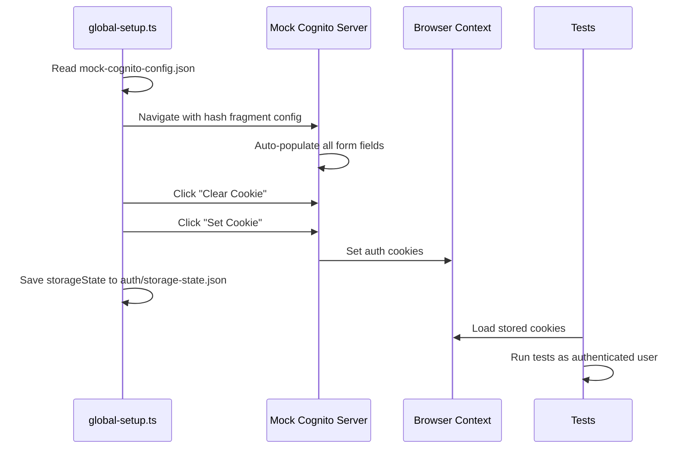

# Walkthrough: Playwright Test Automation Setup

## What Was Built

A complete Playwright test automation project with Allure reporting, mock Cognito authentication, CI/CD pipeline, and Kubernetes deployment.

## Files Created/Modified

| File | Purpose |
|------|---------|
| [package.json](file:///Users/staizen-epi/Development/00_Workspace/gembaa-test/package.json) | Dependencies + npm scripts |
| [playwright.config.ts](file:///Users/staizen-epi/Development/00_Workspace/gembaa-test/playwright.config.ts) | Playwright config with Allure reporter, global auth setup |
| [global-setup.ts](file:///Users/staizen-epi/Development/00_Workspace/gembaa-test/global-setup.ts) | Mock Cognito auth: reads config, populates mock server, saves cookies |
| [specs/README.md](file:///Users/staizen-epi/Development/00_Workspace/gembaa-test/specs/README.md) | Spec format guide |
| [specs/sample-feature.spec.md](file:///Users/staizen-epi/Development/00_Workspace/gembaa-test/specs/sample-feature.spec.md) | Sample spec (home page) |
| [tests/sample-feature.spec.ts](file:///Users/staizen-epi/Development/00_Workspace/gembaa-test/tests/sample-feature.spec.ts) | Sample test mapping to spec |
| [Dockerfile](file:///Users/staizen-epi/Development/00_Workspace/gembaa-test/Dockerfile) | Multi-stage: run tests → serve Allure report via Nginx |
| [.github/workflows/test-and-report.yml](file:///Users/staizen-epi/Development/00_Workspace/gembaa-test/.github/workflows/test-and-report.yml) | CI: build + push report image to Docker Hub |
| [k8s/deployment.yml](file:///Users/staizen-epi/Development/00_Workspace/gembaa-test/k8s/deployment.yml) | K8s Deployment + ClusterIP Service |
| [docs/mock-cognito-config.json](file:///Users/staizen-epi/Development/00_Workspace/gembaa-test/docs/mock-cognito-config.json) | Mock Cognito server configuration (user-provided) |

## Authentication Flow



## Verification Results

### Test Execution ✅
```
✅ Authentication setup complete — cookies saved to auth/storage-state.json

Running 3 tests using 3 workers
  ✓  should not have console errors (1.4s)
  ✓  should have a valid page title (519ms)
  ✓  should load the home page successfully (766ms)

  3 passed (7.7s)
```

### Allure Report ✅
- `allure-results/` generated with test results
- `allure-report/` successfully built with `index.html`
