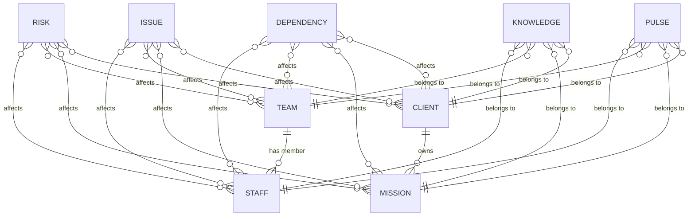

# Gembaa — Global Specification

## Overview

Gembaa is a project portfolio, allocation, and workforce management application. This document defines the **entity model** — the primary and secondary entities, their purpose, and how they relate to each other.

---

## Primary Entities

Primary entities form the core data model of Gembaa.

| Entity   | Description | Module |
|----------|-------------|--------|
| **Staff**   | Individual personnel records. Can be virtual (UI-created) or SCIM-synced (EntraID). | Staff Management |
| **Team**    | A named group of staff. Each staff member may belong to **at most one** team (1:N — Team → Staff). | Team Management |
| **Mission** | A project record. Central to the Allocation module. Each mission belongs to **exactly one** client (1:N — Client → Mission). | Mission Management |
| **Client**  | An external organisation that owns missions. A client can have **many** missions, but a mission can only belong to **one** client. | Client Management |

### Relationship Rules — Primary Entities

```
Team  ──1:N──▶  Staff      (a staff belongs to at most 1 team)
Client ──1:N──▶  Mission    (a mission belongs to exactly 1 client)
```

> [!IMPORTANT]
> These are **exclusive membership** constraints:
> - A staff member **cannot** be on multiple teams simultaneously.
> - A mission **cannot** be shared across multiple clients.

---

## Secondary Entities

Secondary entities capture cross-cutting concerns and are **linked to** primary entities.

| Entity | Category | Description |
|--------|----------|-------------|
| **Risk**        | RID | A potential threat or uncertainty that may impact delivery. |
| **Issue**       | RID | A current problem that is actively affecting progress. |
| **Dependency**  | RID | An external or internal dependency that delivery relies upon. |
| **Knowledge**   | Insight | Captured learnings, notes, or documentation linked to an entity. |
| **Pulse**       | Insight | A health/status indicator or periodic check-in linked to an entity. |

### Linking Rules

Secondary entities connect to primary entities via an **"Affecting"** field (RID) or a direct ownership link (Knowledge, Pulse).

#### RID (Risk, Issue, Dependency)

| Rule | Detail |
|------|--------|
| **Can link to** | Staff, Team, Mission, Client |
| **Cardinality** | **Many-to-many** — a single R / I / D can affect multiple primary entity records |
| **Minimum** | Must be linked to **at least 1** primary entity record upon creation |
| **Mutability** | Links **can** be added or removed after creation (as long as ≥ 1 remains) |

#### Knowledge & Pulse

| Rule | Detail |
|------|--------|
| **Can link to** | Staff, Team, Mission, Client |
| **Cardinality** | **One-to-one** — each Knowledge or Pulse record is linked to exactly **one** primary entity record |
| **Minimum** | Must be linked to **exactly 1** primary entity record upon creation |
| **Mutability** | The link is **immutable** — once created, a Knowledge or Pulse record **cannot** be re-linked to a different primary entity |

---

## Entity Relationship Diagram



---

## Profiles API & Custom Fields

The `/Profiles` API is the single source of truth for **which fields are displayed** on an entity's detail view (side panel, edit dialog, inline editing). It also defines **custom fields** and their editability.

### Endpoint

```
GET /gba-api/CustomFields/Profiles
```

### Source Entity Mapping

Custom fields are assigned to entities via the `sourceId` attribute in the `/Profiles` response:

| `sourceId` | Entity |
|------------|--------|
| `1` | Staff |
| `2` | Mission |
| `3` | Team |
| `4` | Client |
| `5` | Knowledge |
| `6` | Milestone |
| `10` | Risk |
| `11` | Issue |
| `12` | Dependency |

> [!NOTE]
> Only custom fields whose `sourceId` match are displayed on that entity's detail view. For example, a custom field with `sourceId: 1` will appear on Staff detail views but **not** on Mission detail views.

### Reference Fields

Custom fields can be marked as **reference fields** via the `isReferenceField` attribute:

| `isReferenceField` | Behaviour |
|--------------------|----------|
| `true` | The field is **read-only** — it cannot be edited in either the edit dialog or inline editing, regardless of staff type (SCIM or Virtual). |
| `false` / absent | The field follows normal editability rules (editable for Virtual staff; may be restricted for SCIM staff depending on the field). |

> [!IMPORTANT]
> Reference fields are **universally non-editable**. This applies to **all** entity types, not just Staff. The `isReferenceField` flag takes precedence over any other editability rule.

### Terminology Mapping

Any instance where a field's `name` attribute has the prefix `TERMINOLOGY:*` (e.g., `TERMINOLOGY:staff.value`), the exact label displayed in the UI is determined by mapping it against the `/Terminology` API endpoint. 

- If the field originates from the `/Profiles` API with `name: "TERMINOLOGY:team.value Lead"`, the UI will display the translated string from the Terminology dictionary rather than the raw `name` (ie: `Team Lead`).
- Test specs and automation must evaluate the terminology dictionary to locate elements by their correct visible `label` or `hasText` content on the screen.

### Example `/Profiles` Response (Simplified)

```json
{
  "customFields": [
    {
      "name": "Cost Center",
      "isReferenceField": true,
      "sourceId": 1
    },
    {
      "name": "Project Code",
      "isReferenceField": false,
      "sourceId": 2
    },
    {
      "name": "Division",
      "isReferenceField": true,
      "sourceId": 1
    }
  ]
}
```

In this example:
- **Cost Center** appears only on Staff (`sourceId: 1`) and is read-only (`isReferenceField: true`).
- **Project Code** appears only on Mission (`sourceId: 2`) and is editable.
- **Division** appears on both Staff and Mission and is read-only.

---

## Cross-Reference: Feature Specs

Each entity's detailed acceptance criteria and test scenarios live in their own spec files:

| Entity/Module | Spec File | Route | Grid Type |
|---------------|-----------|-------|-----------|
| App Access | [`app-access.spec.md`](app-access.spec.md) | `/` | none |
| Admin Console | [`admin-console.spec.md`](admin/admin-console.spec.md) | `/admin` | table |
| Staff | [`staff-management.spec.md`](foundation/staff-management.spec.md) | `/staff` | table |
| Team | [`team-management.spec.md`](foundation/team-management.spec.md) | `/team` | table |
| Client | [`client-management.spec.md`](foundation/client-management.spec.md) | `/client` | table |
| Mission | [`mission-management.spec.md`](foundation/mission-management.spec.md) | `/mission` | table |
| RID (Risk, Issue, Dependency) | [`raid.spec.md`](raid/raid.spec.md) | `/rid` | ag-grid |
| Knowledge | — *(spec pending)* | — | — |
| Pulse | [`pulses.spec.md`](pulse/pulses.spec.md) | `/pulse` | table |
| Allocation | [`allocation-management.spec.md`](allocation/allocation-management.spec.md) | `/allocation` | table |
| Portfolio / Roadmap | [`portfolio-roadmap.spec.md`](portfolio/portfolio-roadmap.spec.md) | `/portfolio` | gantt |

> **API Reference**: See [`docs/api-reference.md`](../docs/api-reference.md) for the full API specification covering SCIM, GBA API, and BFF (GraphQL) layers.

---

## Spec Authoring Reference

Each `.spec.md` file may include shared frontmatter metadata, but the body of the spec should focus on business requirements and BDD test cases only. Do not add per-scenario `test-hints` sections or other generator-only YAML blocks inside the scenarios.

### Frontmatter Schema

Every spec file starts with a `---` fenced YAML frontmatter block:

```yaml
---
route: /staff                          # URL path for this module
grid_type: table | ag-grid | gantt | none  # determines locator strategy
execution_mode: parallel | serial      # serial when tests mutate shared cookie state
tags: ["@staff", "@permissions"]       # Playwright --grep tags
permissions:                           # map of PERM.* constant key → string value
  VIEW_STAFF: STF-VIEW-STAFF
  MANAGE_STAFF: STF-MANAGE-STAFF
entity_rules:                          # optional, relationship constraints
  parent_of: Staff (1:N)
  child_of: Client
  can_link_to: [Staff, Team, Mission, Client]
  cardinality: many-to-many | one-to-one
  min_links: 1
  mutability: mutable | immutable
api:                                   # optional, for modules with API interactions
  scim_base: http://localhost:5050
  endpoints:
    create: POST /scim/Users
    patch: PATCH /scim/Users/{identifier}
profiles_api:                          # optional, field definitions source
  endpoint: GET /gba-api/CustomFields/Profiles
  source_id: 1                         # sourceId for this entity
  notes: >
    Custom fields are filtered by matching this source_id.
    Fields with isReferenceField = true are non-editable.
scim_readonly_fields:                  # optional, SCIM-locked fields (Staff only)
  - Display Name
  - First Name
  - Last Name
ui_notes:                              # locator hints for the code generator
  list_element: "locator('table').first()"
  create_button: "getByRole('button', { name: /create|add|new/i })"
---
```

### Key Conventions

| Convention | Detail |
|-----------|--------|
| `default_global_setup` | Tests use pre-authenticated state from `global-setup.ts` — all permissions granted |
| `setMockPermissions()` | Overrides permissions via mock Cognito server for permission-denied scenarios |
| `TIMEOUT.DEFAULT` | 10 s — standard assertion timeout |
| `TIMEOUT.LONG` | 15 s — for data loading (AG Grid, SCIM ops) |
| `TIMEOUT.SHORT` | 2 s — for elements that may not exist |
| `TIMEOUT.DEBOUNCE` | 1 s — for search debounce / animation settle |
| `LOAD_STATE.DOM` | `domcontentloaded` — use after `goto` navigation |
| `LOAD_STATE.IDLE` | `networkidle` — use after in-page interactions |
| `LABEL.QUICK_SEARCH` | `"Quick Search"` — placeholder text for search inputs |
| `LABEL.USER_MENU_BUTTON` | `"Local Gembaa USER"` — user menu toggle |

### Constants Quick Reference (`tests/constants.ts`)

| `PERM.*` Key | String Value | Module |
|-------------|--------------|--------|
| `APP_ACCESS` | `GBA-APP-ACCESS` | Global |
| `VIEW_PERMISSIONS` | `PER-VIEW-PERMISSIONS` | Admin |
| `MANAGE_PERMISSIONS` | `PER-MANAGE-PERMISSIONS` | Admin |
| `VIEW_STAFF` | `STF-VIEW-STAFF` | Staff |
| `MANAGE_STAFF` | `STF-MANAGE-STAFF` | Staff |
| `VIEW_INACTIVE_STAFF` | `STF-VIEW-INACTIVE_STAFF` | Staff |
| `VIEW_TEAM` | `STF-VIEW-TEAM` | Team |
| `MANAGE_TEAM` | `STF-MANAGE-TEAM` | Team |
| `VIEW_MISSION` | `MSN-VIEW-MISSION` | Mission |
| `MANAGE_MISSION` | `MSN-MANAGE-MISSION` | Mission |
| `VIEW_CLIENT` | `MSN-VIEW-CLIENT` | Client |
| `MANAGE_CLIENT` | `MSN-MANAGE-CLIENT` | Client |
| `VIEW_ALLOCATION` | `MSN-VIEW-ALLOCATION` | Allocation |
| `MANAGE_ALLOCATION` | `MSN-MANAGE-ALLOCATION` | Allocation |
| `VIEW_FINANCE_ENTRY` | `MSN-VIEW-FINANCE_ENTRY` | Mission |
| `MANAGE_FINANCE_ENTRY` | `MSN-MANAGE-FINANCE_ENTRY` | Mission |
| `VIEW_DAILY_CAPACITY` | `MSN-VIEW-DAILY_CAPACITY` | Mission |
| `VIEW_PULSE` | `GBA-VIEW-PULSE` | Pulse |
| `MANAGE_PULSE` | `GBA-MANAGE-PULSE` | Pulse |
| `MANAGE_MILESTONE` | `GBA-MANAGE-MILESTONE` | Pulse |
| `VIEW_RAID` | `GBA-VIEW-RAID` | RID |
| `MANAGE_RAID` | `GBA-MANAGE-RAID` | RID |

### API Utilities (`tests/api/`)

Reusable API utility classes for test setup, teardown, and data verification. Import from the barrel:

```typescript
import { ScimApi, GbaApi, BffApi, SCIM_OP, SOURCE_ENTITY } from "./api";
```

#### `ScimApi` — SCIM 2.0 (Staff provisioning)

| Method | Description |
|--------|-------------|
| `ScimApi.createUser(options)` | Create a SCIM user. Returns the full user response. |
| `ScimApi.patchUser(id, operations)` | Patch a SCIM user with operations `[{ op, path, value }]`. |
| `ScimApi.deleteUser(id)` | Delete a SCIM user. |
| `ScimApi.getUser(id)` | Get a single SCIM user by identifier. |
| `ScimApi.listUsers()` | List all SCIM users. |
| `ScimApi.activateUser(id)` | Convenience: set `active = true`. |
| `ScimApi.deactivateUser(id)` | Convenience: set `active = false`. |
| `ScimApi.updateDisplayName(id, name)` | Convenience: replace `displayName`. |
| `ScimApi.listGroups()` | List all SCIM groups. |

`SCIM_OP` constants: `ADD = 0`, `REMOVE = 1`, `REPLACE = 2`.

#### `GbaApi` — Gembaa REST API

| Method | Description |
|--------|-------------|
| `GbaApi.getProfiles()` | Get all custom field profiles (`/CustomFields/Profiles`). |
| `GbaApi.getProfilesBySourceEntity(sourceId)` | Filter profiles by `sourceId`. |
| `GbaApi.getReferenceFields(sourceId)` | Get reference-only fields (`isReferenceField = true`). |
| `GbaApi.getCustomFieldData(entityId)` | Get custom field data for a source entity instance. |
| `GbaApi.listStaff()` | List all staff via GBA API. |
| `GbaApi.getStaff(id)` | Get a staff member by ID. |
| `GbaApi.listRid(type)` | List Risk / Issue / Dependency entities. |
| `GbaApi.createRid(type, data)` | Create a RID entity. |
| `GbaApi.deleteRid(type, id)` | Delete a RID entity. |
| `GbaApi.getLinkedRid(type, sourceEnum, entityId)` | Get RID entities linked to a primary entity. |
| `GbaApi.getActivityLogs(entityType, id)` | Get activity logs for an entity. |
| `GbaApi.getPermissions(entityType)` | Get permissions for an entity type. |

`SOURCE_ENTITY` constants: `STAFF = 1`, `MISSION = 2`, `TEAM = 3`, `CLIENT = 4`, `KNOWLEDGE = 5`, `MILESTONE = 6`, `RISK = 10`, `ISSUE = 11`, `DEPENDENCY = 12`.

#### `BffApi` — GraphQL (via browser session)

> **Note**: BFF methods require a Playwright `Page` argument since requests go through the browser's authenticated cookies.

| Method | Description |
|--------|-------------|
| `BffApi.execute(page, query, variables?)` | Run an arbitrary GraphQL query/mutation. |
| `BffApi.getStaff(page, options?)` | Query paginated staff list. |
| `BffApi.createVirtualStaff(page, input)` | Create a virtual staff member. |
| `BffApi.updateEmploymentDetails(page, input)` | Update employment details. |
| `BffApi.deleteVirtualStaff(page, input)` | Delete a virtual staff member. |
| `BffApi.getClients(page, options?)` | Query paginated client list. |
| `BffApi.getMissions(page, options?)` | Query paginated mission list. |
| `BffApi.getTeams(page, options?)` | Query paginated team list. |
| `BffApi.getAdminSettings(page)` | Query admin settings. |
| `BffApi.getStaffMetadata(page)` | Query staff form metadata. |
| `BffApi.getDashboard(page)` | Query dashboard quick stats. |

---

## Test Fixtures & Setup

### `test.extend` Fixtures

Login happens **once per worker** using Playwright's fixture system.

**Benefits:** Cleaner tests, automatic setup/teardown, worker-scope option.

### API-Based Cleanup Mechanism

**Approach:** Call backend API endpoints directly for cleanup in `afterAll` / `afterEach` hooks.

```typescript
import { test, expect } from "@playwright/test";
import { BffApi } from "./api";

test.afterAll(async ({ page }) => {
    // Clean up any entities created during the test via API
    // Use the API utility classes (ScimApi, GbaApi, BffApi)
});

test("create entity test", async ({ page }) => {
    // ... test actions ...
    // Cleanup happens automatically in afterAll via API utilities
});
```

**Benefits:**

- Faster than UI-based cleanup
- Works even if test fails mid-flow
- Centralised — add new methods to the utility class, not inline in test files
- All API calls include proper authentication cookies automatically

---

## BDD Scenario Format

Each `.spec.md` file uses **Given / When / Then** BDD scenarios:

```
## Scenario 1: Upload Single File
**Given** user is on library page
**When** user clicks Browse Document and selects dummy.docx
**Then** file appears in table with status "uploaded"

## Scenario 2: Upload Multiple Formats
**Given** user is on library page
**When** user uploads files: docx, pdf, jpg
**Then** all 3 files appear in table
```

Each scenario should remain plain-language Given / When / Then documentation with no embedded `test-hints` YAML block.

---

## Recommended Workflow

```
1. DEVELOPER/QA ADDS/UPDATES BDD
   Decides if BDD update needed
              |
              v
2. DEVELOPER OPENS PR with BDD
   Push changes to branch
              |
              v
3. Someone approves BDD PR
              |
              v
4. DEVELOPER IMPLEMENTS FEATURE
              |
              v
5. AI GENERATES/UPDATES TESTS
   - AI reads the relevant .spec.md
   - AI writes/updates .spec.ts
   - Developer runs test to verify
              |
              v
6. NIGHTLY CI RUNS ALL TESTS
   npm run test:e2e:dev  (on dev environment)
   npm run test:e2e:local (on localhost for debugging)
```

---

## CI Workflow Enforcement

**CI workflow that comments on PR but doesn't block merge:**

```yaml
# .github/workflows/bdd-check.yml
name: BDD Sync Check
```

**Benefits:**

- Doesn't block developers
- Creates visibility in PR
- Easy to ignore for small changes
- No local tooling required
